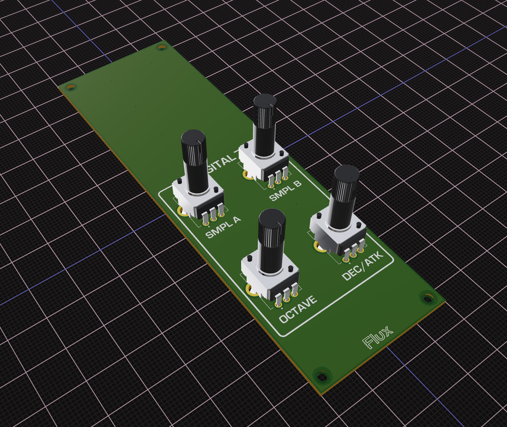

# pro1-modsample

Firmware for the Behringer Pro-1 ModSample modification for the Raspberry PI Pico.

The ModSample can add low-fi sample playing capability to the synthetizer, which can then be processed by the Pro-1 filter and amplifier and summed to the other two oscillators.

## Building the Hardware

You can build your PCB from this [Flux project](https://www.flux.ai/giulioz/pro-1-modsample-template).



## Building the Firmware

Build project using cmake. This requires Raspberry Pi Pico C/C++ SDK to be installed. 
```
git clone https://github.com/giulioz/pro1-modsample.git
mkdir build
cd build
cmake ..
make
```

Then copy modsample.uf2 to your Raspberry Pi Pico!

## Credits

The PWM audio out is based off an [example](https://github.com/rgrosset/pico-pwm-audio.git) by Robin Grosset. Thanks!
